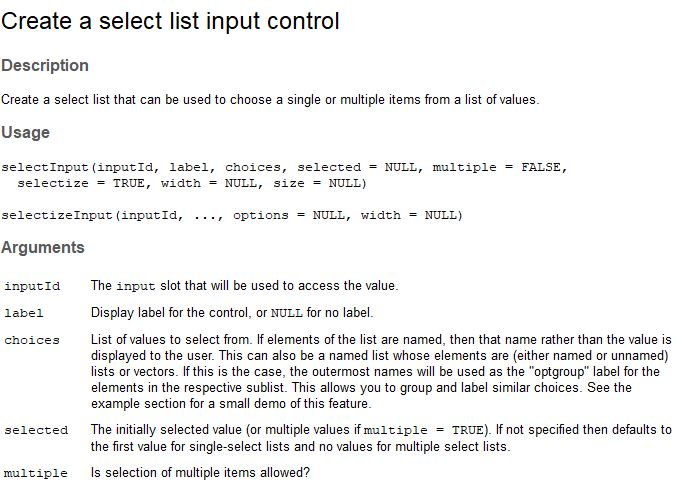
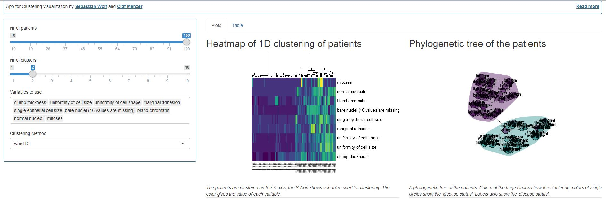

# Example of a visulization app for reasearch in biostatistics


## What is it about?

The story behind this app comes from a real application inside departments
evaluating clinical studies in diagnostics.

Due to fast recruiting for a clinical studies
the patient cohorts seemed to be inhomogenic. Therefore a researcher and
a clinical study statistician wanted to find out, by which parameter
they can find patients, that do not seem to fit their desired class. Maybe
there was a mistake in the labeling of a patients disease status? Maybe
one measurement or two measurements can be used to easily find such patients.

The example data used here is real data from a study from the 70s. The
app that should be build inside this tutorial is preliminar and was especially
build for the tutorial. Pieces of it were applied in biostatistical applications.

## Starting point

To start the tutorial in R please run:

```
install.packages(c("ape","dplyr",magrittr","igraph","viridisLite","MASS","shiny"))
```

if you have all the packages installed you will have one file
to work on. This file is `app.R`. This `app.R` allows you to build a [shiny](https://shiny.rstudio.com/) application.

This file we will use to
insert the right visualizations and the right table for the
researcher to fullfil the task named above. To check what the
app will finally look like you can already perform `runApp()` inside
the console and your browser will open the app.

The app already contains:

A `sideBarPanel` that has all the inputs we need
* Slider for the # of patients
* Slider for the # of desired clusters/groups
* Empty input to choose measurements - shall be done by you
* Dropdown field for the clustering method

A `server` function that will provide
1. The empty input to choose measurments
2. A Heatmap to see the outcome of clustering
3. A Phylogenetic tree plot to see the outcome of clustering
4. A table to see the outcome of the clustering

It already contains a function to provide you with the 
input data sets `biopsy` and `biopsy_numeric()`, as `biopsy_numeric`
is a [reactive](https://shiny.rstudio.com/tutorial/written-tutorial/lesson6/).

In this tutorial we will go through step 1-4 to enable building the app

## The input data set

The patients inside the data set were obtained from the University of Wisconsin Hospitals, Madison
from Dr. William H. Wolberg. He assessed biopsies of breast tumours for 699 patients up to 15 July
1992; each of nine attributes has been scored on a scale of 1 to 10, and the outcome is also known.
There are 699 rows and 11 columns.

The data set can be called by the variable `biopsy` inside the app. The columns 2-10 were
stored inside the reactive `biopsy_numeric()` which is filtered by the `input$patients` input
to not use all 699 patients, but between 1 and 100.

## 1) Construction of a `SelectInput`

The `SelectInput` shall allow the user to not use all 9 measured variables, but just
the ones he desires. We can therefore look at the description of the selectInput by

```
?shiny::selectInput
```

and see



We now need to build the `choices` as the column names of the biopsy data set from 2-10.
the `selected` input will be the same. We shall allow multiple inputs, so `multiple` will
be set to `TRUE`. Additionally we shall name the `inputId` "vars". So we can replace the part
`output$variables` inside the `app.R` file with this:

```
output$variables <- renderUI({
    selectInput(inputId="vars", 
                label = "Variables to use", 
                choices = names(biopsy)[2:10],
                multiple = TRUE,
                selected = names(biopsy)[2:10]
    )
  })
```

And you're done.

## 2) A Heatmap to see the outcome of clustering

The basic [`heatmap`](https://stat.ethz.ch/R-manual/R-patched/library/stats/html/heatmap.html) function allows you to draw a heat map. In this case
we would like to change a few things. We would like to change the clustering method inside the `hclust` function
to a method defined by the user. We can grab the user defined method by using `input$method` as we
already defined this input field as a drop down menu.
We have to overwrite the default hclust method with our method by:

```
my_hclust <- function(...){
      hclust(method=my_method,...)
    }
    my_method <<- input$method
```

Be aware that you define a global variable `my_method` here. But for the tutorial this shall work. You can find a lot on the internet why global variables are bad.

Now for the heatmap call we basically need to change a few inputs. Please see the result:
```
heatmap(x = t(as.matrix(biopsy_numeric())), Rowv=NA, hclustfun=my_hclust,
            labCol =biopsy$"disease status",
            col=viridis(15)
    )
```
We need to transform the biopsy_numeric matrix, as we would like to have the patients in columns. As there
is just a one dimensional clustering, we can switch of row labels by setting `Rowv` to `NA`. The `hclustfun`
is overwritten by our function `my_hclust`.

For coloring of the plot we use the `viridis` palette as it is a color blind friendly palette. And the
labels of our columns shall now not only the patient IDs but the disease status. You can see the
names of all columns we defined in the file `R/utils.R`. There you see that the last column of `biopsy`
is called "disease status". This will be used to label each patient. Now we got:

```
output$plot1 <- renderPlot({
    my_hclust <- function(...){
      hclust(method=my_method,...)
    }
    my_method <<- input$method
    heatmap(x = t(as.matrix(biopsy_numeric())), Rowv=NA, hclustfun=my_hclust,
            labCol =biopsy$"disease status",
            col=viridis(15)
    )
  })
```

Part 2 is done

# 3) Plot a phylogenetic tree

To allow plotting a phylogenetic tree we provided you a function called `phyltree`. You can read
the whole code of the function inside `R/utils.R`. This function takes as inputs 

* a numeric matrix > `biopsy_numeric()` **CHECK**
* The clustering method > `input$method` **CHECK**
* The number of clusters > `input$nc` **CHECK**
* A color function > `viridis` **CHECK**

You can read why to use `()` behind `biopsy_numeric` [here](https://shiny.rstudio.com/tutorial/written-tutorial/lesson6/).

The hard part are now the labels. The `biopsy_numeric` data set is filtered by the # of patients.
Therefore we have to filter the labels, too. Therefore we use

```
labels = biopsy %>% select("disease status") %>% 
                filter(row_number() <= input$patients) %>% 
                mutate_all(as.character) %>% 
                pull("disease status")
```

This is a workflow using functional programming with the R-package `dplyr`. The function `select`
allows us to just select the "disease status". The `filter` function filters the number
of rows. The `mutate_all` function applies the `as.character` function to all columns and
finally we export the labels as a vector by using `pull`.

* labels for the tree nodes > `biopsy %>% ...` **CHECK**

The final result looks like this

```
output$plot2 <- renderPlot({
    phyltree( x = biopsy_numeric(),
              method = input$method,
              nc = input$nc,
              color_func = "viridis",
              labels = biopsy %>% select("disease status") %>% 
                filter(row_number() <= input$patients) %>% 
                mutate_all(as.character)%>% 
                pull("disease status")
    )
  })
```

# 4) Create a table from clustering results

Now we would also like to see for each patient in which cluster she was assigned.
Therefore we perform the clustering and tree cutting on our own:

```
clust <- hclust(dist(biopsy_numeric()), method = input$method)
cluster_assigment = cutree(clust, k = input$nc) #cluster assignement
```

The cluster_assignment is now a vector with numbers for the clusters for 
each patient such as `c(1,2,1,1,1,2,2,1,...)`. This information can 
be helpful if we combine it with the patientID and the disease status
that was named in the patients forms.

The task will be performed using the `cbind` function of R:
```
out_table <- cbind(
      cluster_assigment,
      biopsy %>% filter(row_number() <= length(cluster_assigment)) %>% select(c(1,11))
    )# cbind
```

Now this table shall be sorted by the `cluster_assigment` to get a faster 
view on which patients landed in the wrong cluster.

```
out_table %>% arrange(cluster_assigment)
```

The final code:

```
output$cluster_table <- renderTable({
    
    # --------- perform clustering ----------------
    
    # Clustering via Hierarchical Clustering
    clust <- hclust(dist(biopsy_numeric()), method = input$method)
    cluster_assigment = cutree(clust, k = input$nc) #cluster assignement
    
    # Create a table with the clusters, Patient IDs and Disease status
    out_table <- cbind(
      cluster_assigment,
      biopsy %>% filter(row_number() <= length(cluster_assigment)) %>% select(c(1,11))
    )# cbind
    # Order by cluster_assigment
    out_table %>% arrange(cluster_assigment)
  }
  
)
```

Done

## What to do now?

Now you can run the `runApp()` function. 



If you choose 100 patients, 2 clusters, "ward.D2" clustering and all variables
you will see pretty fast, that the patients:

* 1002945
* 1016277
* 1018099
* 1096800

could be identified as the patients that were clustered wrong. Now you can go search for problems in clustering
or look at the sheets of those patients. By changing the labeling inside the `phyltree` function call, you can even
check which other patients show close measurements to these patients. **Explore and play!**


